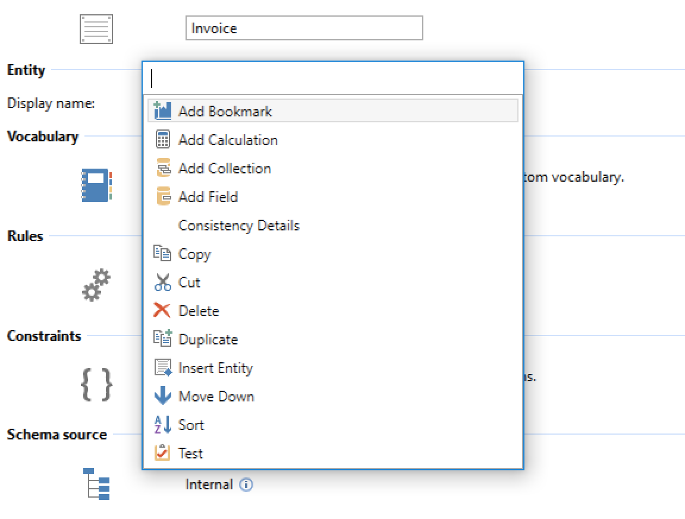

The Commander extenison allows the user to execute a command for the currently selected item via the keyboard by pressing Control+. (period) to get a list of all commands available. The list can be filtered by typing and the user can select the command to execute using the cursor keys.

