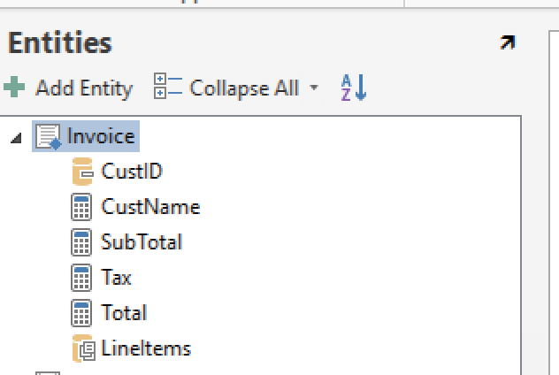
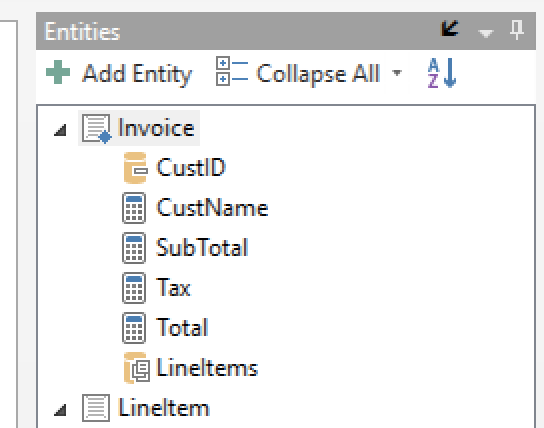

# Navigation Tool Windows for IrAuthor

## Requirements

## Usage notes
Adds an arrow to the upper-right corner of each navigation pane that allows the user to pop out the current navigation pane into a tool window:

The tool windows may then be aligned to any part of irAuthor or floated:

To dock the navigation pane back into the navigation bar, click the arrow in the upper-right of the tool window.

## Version History
