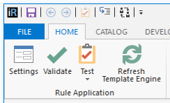

# Refresh Template Engine for IrAuthor

##Requirements

##Usage notes
It's possible to reset the template engine via the Options dialog, but if you find yourself needing to do it occasionally even those few clicks can seem burdensome. This extension puts the functionality front and center in the Home ribbon.

##Version History

### initial release 31-Jan-2019
